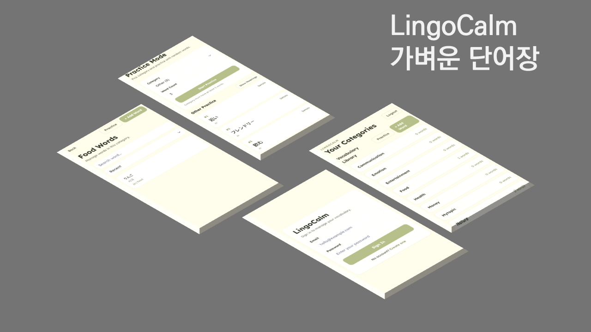

# Week Dev Challenge - 5일차

# 📘 LingoCalm

> 가볍고 편리한 단어장 서비스
> 
> 
> 

---

## 🚀 Overview

이 프로젝트는 웹 기반으로 메모장과 가장 유사한 경험을 할 수 있는 가벼운 단어장입니다.

기존의 단어장 서비스는 비대한 서비스를 연결하여 제공해왔습니다. 

이 프로젝트는 추가 기능은 모조리 제거하고 단어 기록과 분류에만 집중한 서비스입니다.

---

## 🛠 Tech Stack

### 개발언어 및 프레임워크
개발언어: Python 3

백엔드 프레임워크: FastAPI

### DB 및 서버
DB: PostgreSQL

Hosting: Render

---
